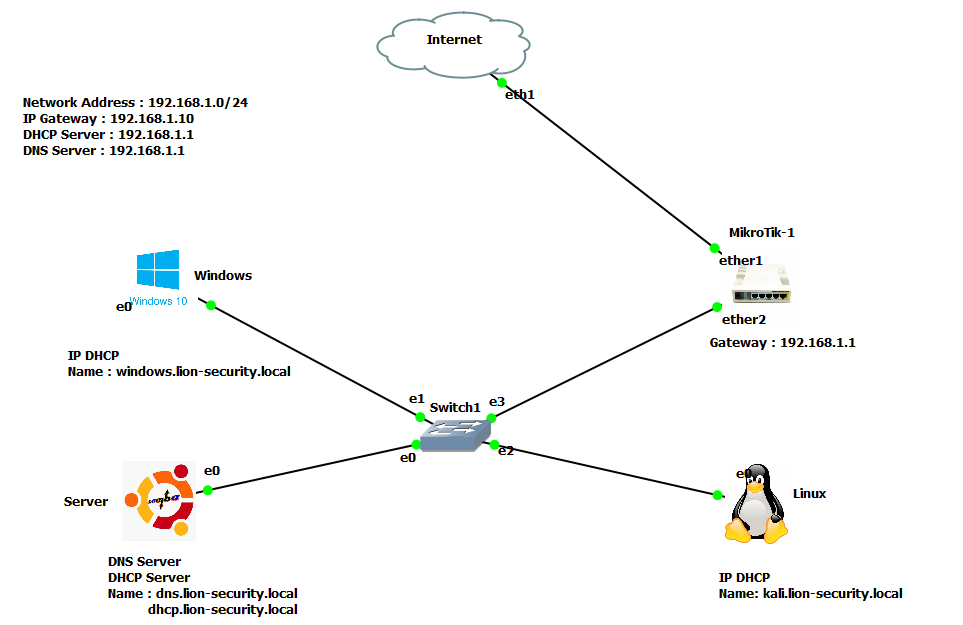
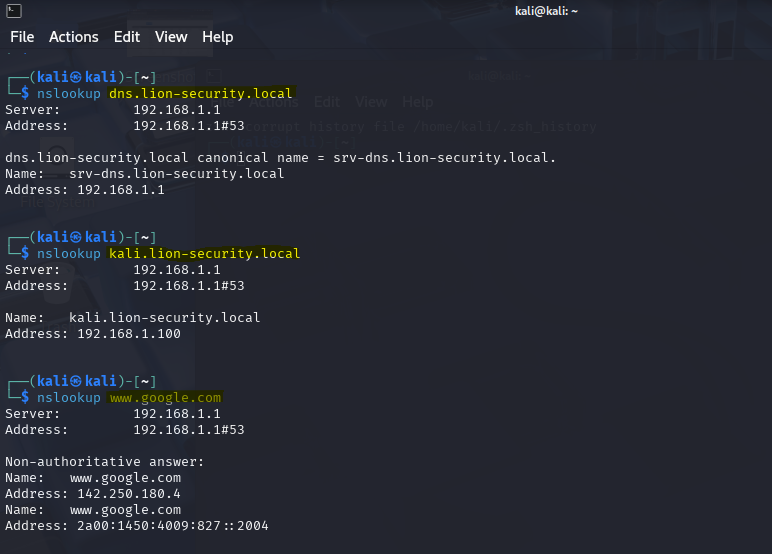

# Configuration d’un Serveur DNS avec Bind9 sur Ubuntu Server

Ce guide explique comment configurer un serveur DNS primaire sous Ubuntu Server à l’aide de **Bind9**. Il inclut une vue d’ensemble de l’architecture et des exemples de tests de fonctionnement.

---

## ✅ Prérequis

- Ubuntu Server (22.04 ou équivalent)
- Accès root ou sudo
- Bind9 installé :
  
```bash
sudo apt update
sudo apt install bind9 bind9utils bind9-doc dnsutils
```

---

## 🧭 Architecture

L'architecture de notre réseau d'entreprise est le suivant :



---

## ⚙️ Étapes de configuration

Vous pouvez vous servir de ces fichiers pour configurer votre serveur DNS

1. **Configurer les options globales de Bind9**

   Modifier le fichier :  
   `/etc/bind/named.conf.options`

2. **Déclarer votre zone DNS**

   Modifier ou compléter le fichier :  
   `/etc/bind/named.conf.local`

3. **Créer le fichier base de données de zone**

   - Créer votre fichier pour la resolution de noms :  
     `/etc/bind/db.lion-security.local`
   - Créer votre fichier pour la résolution inverse :
     `/etc/bind/db.192.168.1`

4. **Vérifier la configuration**

```bash
sudo named-checkconf
sudo named-checkzone monsite.local /etc/bind/zones/db.monsite.local
```
Si vous n'obtenez pas d'erreur c'est tout s'est bien passé

5. **Redémarrer le service Bind9**

```bash
sudo systemctl restart bind9
```

---

## 🧪 Tests de fonctionnement

1. **Tester la résolution DNS depuis un client linux**

```bash
nslookup dns.lion-security.local
```

2. **Exemple de résultat**

Dans notre cas, nous avons effectué un test avec les noms de domaines dans notre base de données de noms ainsi vers www.google.com



---

## 📌 Remarques

- Assurez-vous que le port 53 est ouvert (TCP/UDP).
- Adaptez les noms de domaine et adresses IP selon votre environnement réseau.
- Utilisez `dig` ou `nslookup` pour les diagnostics.

---

## 🔗 Ressources utiles

- [Bind9 Documentation](https://bind9.readthedocs.io/)
